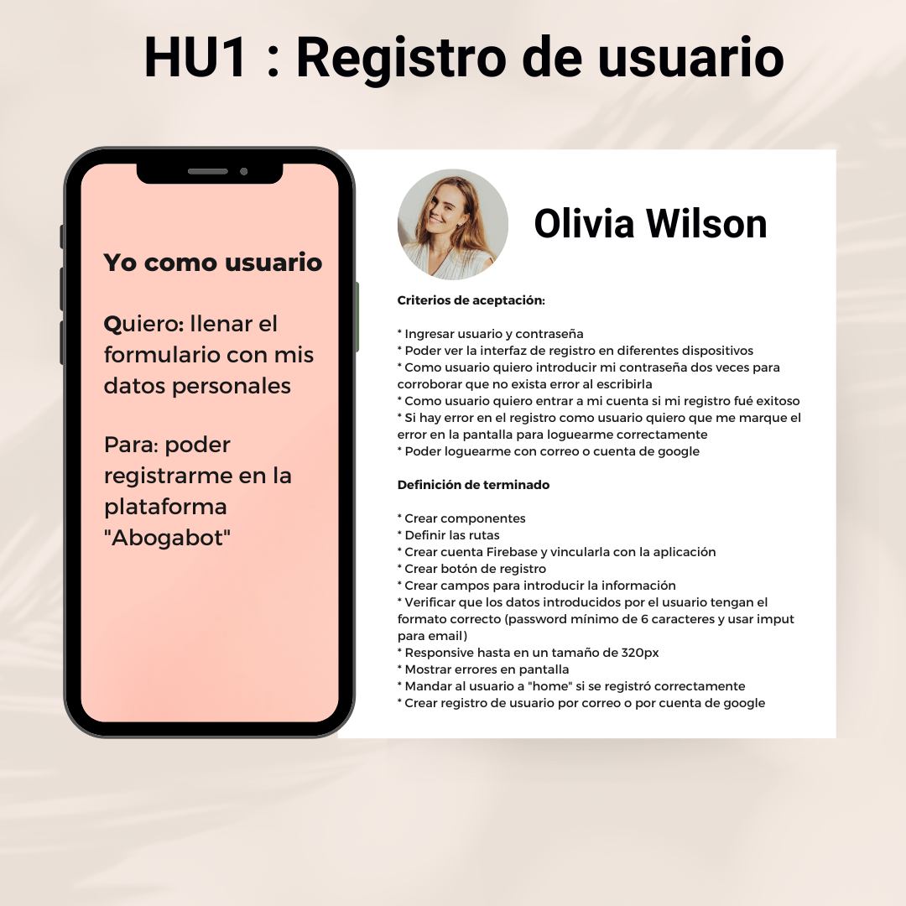
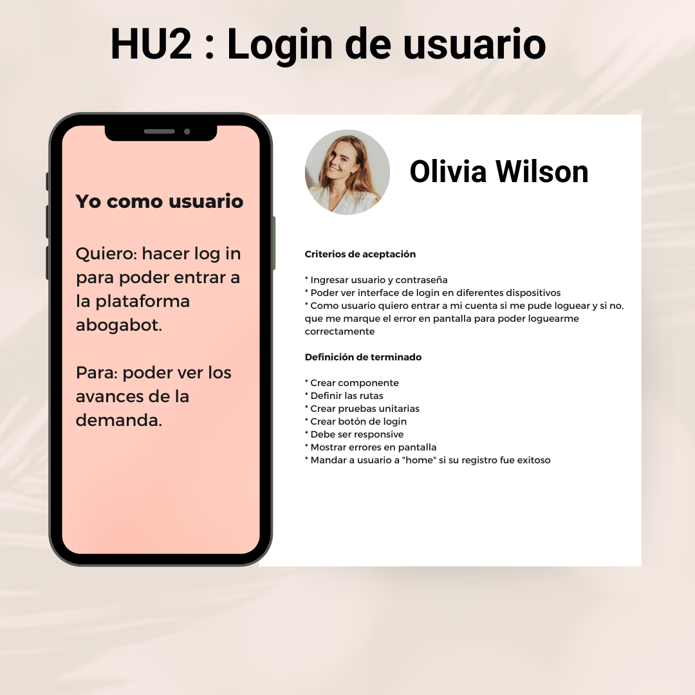
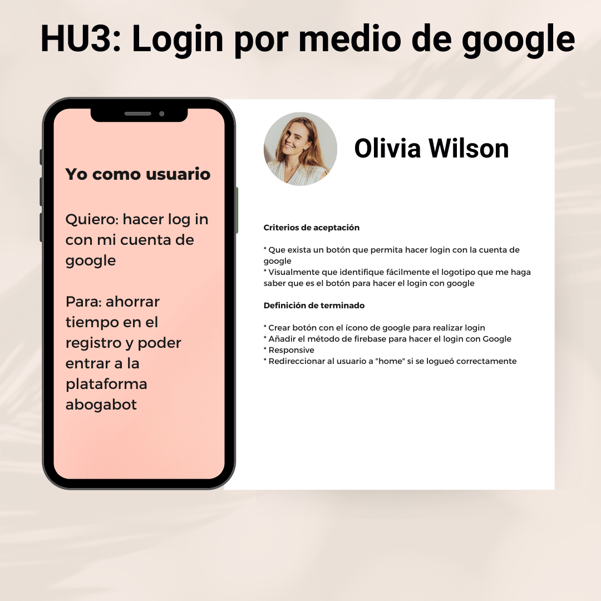
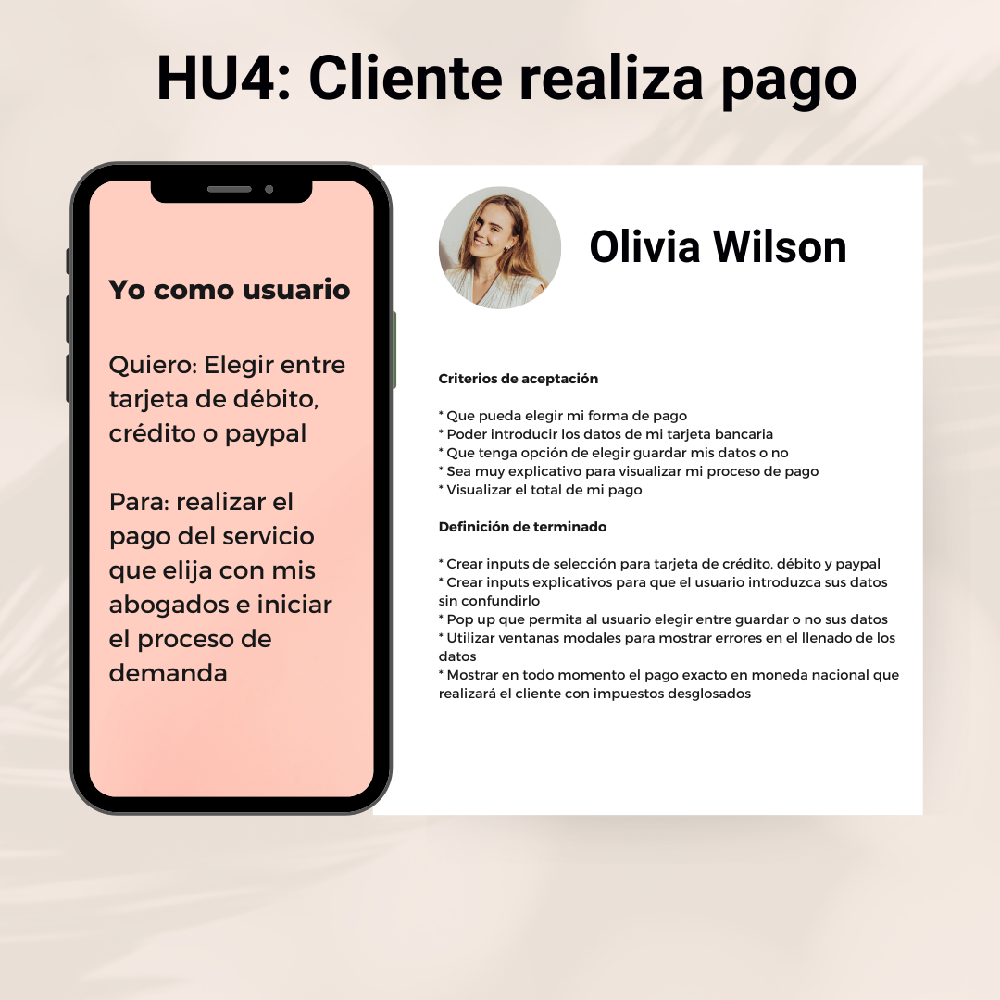
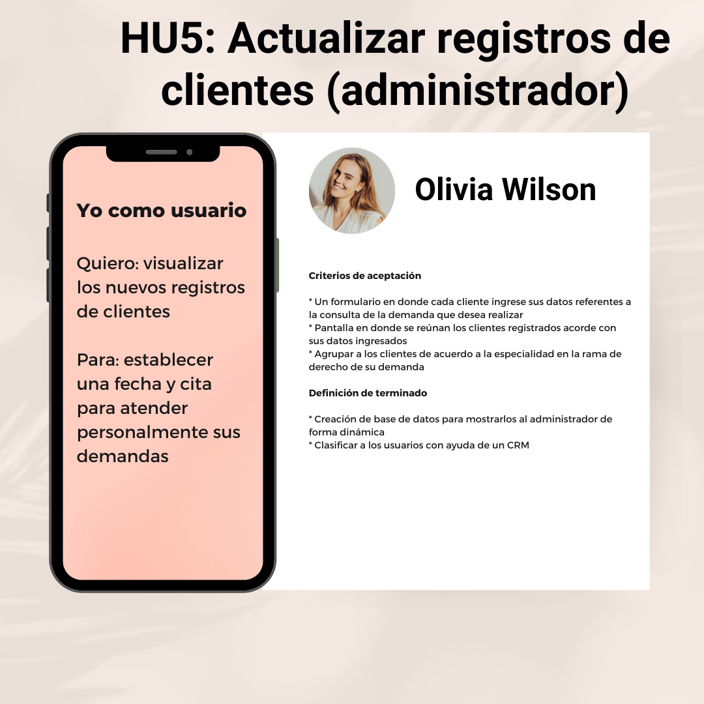
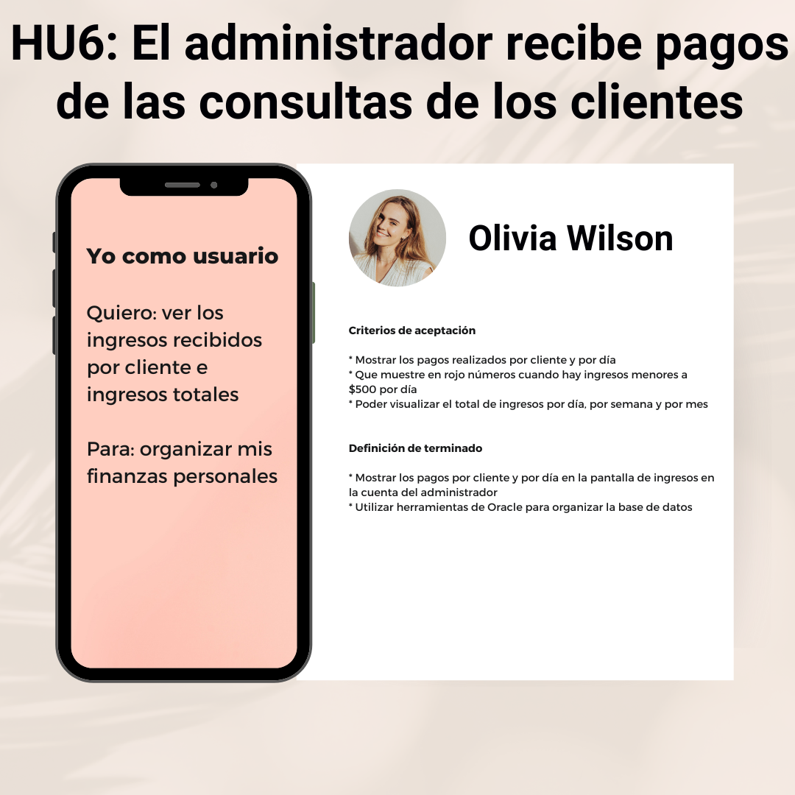

# abogabot-launchX

Caso: "Abogabot" | Creando una página web

Práctica de intro a Frontend de LaunchX powered by Microsoft

## Índice

[1. Resumen del proyecto](#1-Resumen-del-proyecto) 
[2. Requerimientos](#2-Requerimientos) 
[3. Buyer persona](#3-Buyer-persona) 
[4. Público objetivo](#4-Público-objetivo) 
[5. Historias de usuario](#5-Historias-de-usuario) 
[6. Wireframes UX](#6-Wireframes-UX) 
[7. Diseño de la interfaz de usuario - UI](#7-Diseño-de-la-interfaz-de-usuario-UI) 

### 1. Resumen del proyecto

En este proyecto puse en práctica conocimientos generales para construir un previo de la página web "Abogabot", de un despacho de abogados que busca automatizar las demandas de sus clientes, notificarlos de las actualizaciones en su proceso, realizar pagos y crear usuario dentro de la plataforma web.

El objetivo principal de aprendizaje del proyecto es construir "Abogabot" en su fase de "baja fidelidad" y "alta fidelidad".

### 2. Requerimientos

El PDF se encuentra arriba ↑↑

### 3. Buyer persona

El PDF se encuentra arriba ↑↑

### 4. Público objetivo
  
Acceso a <a href="https://miro.com/app/board/uXjVOK2a9pc=/?invite_link_id=101635928904">Miro<a>
El archivo en .jpeg se encuentra arriba ↑↑

### 5. Historias de usuario
  

### 6. Wireframes

### 7. Diseño de la interfaz de usuario